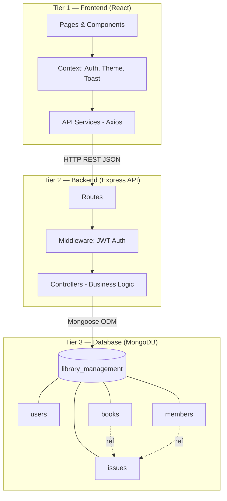
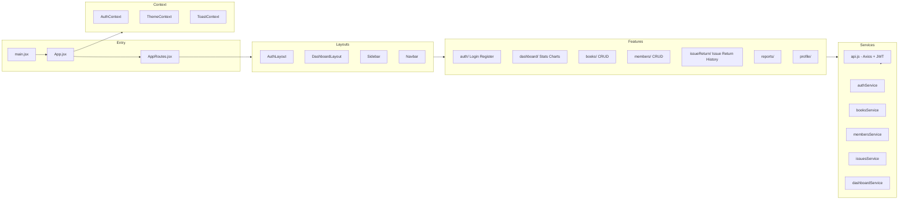
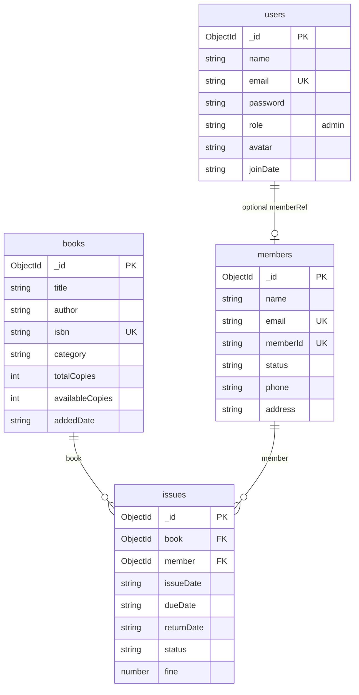
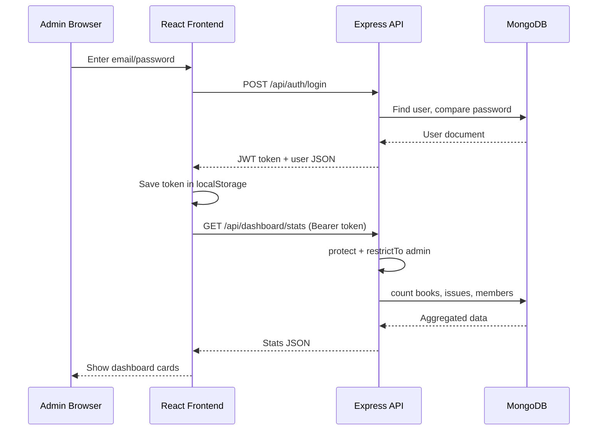

# LMS — Library Management System  
## Faculty Presentation Guide (Architecture + Code Reference)

**Student project:** Full-stack web app for library administration  
**Stack:** React (Vite) + Node.js (Express) + MongoDB (Mongoose)  
**Brand name:** **LMS** = Library Management System  

---

## 1. High-Level System Architecture (3-Tier)



**How data flows (example: Issue a book)**  
1. Admin selects member + book on `IssueBookPage.jsx`  
2. `issuesService.issueBook()` → `POST /api/issues` with JWT token  
3. `issuesController.issueBook()` validates, creates `Issue`, decreases `availableCopies`  
4. MongoDB stores the record; response returns to UI → toast + refresh  

---

## 2. Frontend Architecture



| Layer | Technology | Role |
|--------|------------|------|
| UI | React 19 + Tailwind CSS | Pages, forms, tables, charts |
| Routing | React Router v7 | URLs, protected admin routes |
| State | React Context | Login session, theme, notifications |
| HTTP | Axios | Calls backend API with Bearer token |
| Charts | Recharts | Dashboard & reports visualization |
| Animation | Framer Motion | Page transitions |

---

## 3. Backend Architecture

```mermaid
flowchart TB
    server[server.js - Start server]
    app[app.js - Express app]
    db[config/db.js - MongoDB connect]

    server --> app
    server --> db

    subgraph Routes
        ar[/api/auth]
        br[/api/books]
        mr[/api/members]
        ir[/api/issues]
        dr[/api/dashboard]
    end

    subgraph Middleware
        protect[protect - Verify JWT]
        restrict[restrictTo admin]
        err[errorHandler]
    end

    subgraph Controllers
        ac[authController]
        bc[booksController]
        mc[membersController]
        ic[issuesController]
        dc[dashboardController]
    end

    subgraph Models
        User[User.js]
        Book[Book.js]
        Member[Member.js]
        Issue[Issue.js]
    end

    app --> Routes
    Routes --> protect --> restrict --> Controllers
    Controllers --> Models
```

| Layer | Technology | Role |
|--------|------------|------|
| Runtime | Node.js | Runs API server (port 5000) |
| Framework | Express 5 | REST endpoints, JSON body |
| Auth | JWT + bcryptjs | Login token, password hashing |
| ODM | Mongoose 8 | Schemas, queries, validation |
| Config | dotenv | `.env` for DB URL, secrets |

---

## 4. Database Design (MongoDB)

**Database name:** `library_management`  
MongoDB uses **collections** (like tables in SQL).



| Collection | Purpose | Key fields |
|------------|---------|------------|
| **users** | Admin login accounts | `email`, hashed `password`, `role: admin` |
| **books** | Library catalog | `isbn` unique, `availableCopies` updated on issue/return |
| **members** | Borrowers (not app users) | `memberId` e.g. MEM001, `status: active/inactive` |
| **issues** | Loan records | Links `book` + `member`, `dueDate`, `fine`, `status` |

**Business rules in DB logic:**  
- Max **3** active issues per member (`MAX_BOOKS_PER_MEMBER`)  
- Fine: **₹5/day** after due date (`FINE_PER_DAY`)  
- Default loan: **14 days** if due date not sent; UI allows custom due date  
- `status` auto-updates to `overdue` when due date passes  

---

## 5. API Endpoints Summary

| Module | Method | Endpoint | Function |
|--------|--------|----------|----------|
| Auth | POST | `/api/auth/register` | Create admin account |
| Auth | POST | `/api/auth/login` | Login, return JWT |
| Auth | GET | `/api/auth/profile` | Get logged-in admin |
| Auth | PUT | `/api/auth/profile` | Update name/email |
| Auth | PUT | `/api/auth/change-password` | Change password |
| Books | GET/POST | `/api/books` | List / add books |
| Books | GET/PUT/DELETE | `/api/books/:id` | View / edit / delete |
| Members | GET/POST | `/api/members` | List / add members |
| Members | GET/PUT/DELETE | `/api/members/:id` | View / edit / delete |
| Issues | POST | `/api/issues` | Issue book (optional `dueDate`) |
| Issues | PUT | `/api/issues/:id/return` | Return book, calculate fine |
| Issues | GET | `/api/issues/history` | Full issue history |
| Dashboard | GET | `/api/dashboard/stats` | Total books, issued, overdue, etc. |
| Dashboard | GET | `/api/dashboard/monthly` | Chart data |
| Dashboard | GET | `/api/dashboard/categories` | Pie chart by category |

All routes except `register` and `login` require **JWT** in header:  
`Authorization: Bearer <token>`

---

## 6. Frontend — File Reference

### Entry & routing

| File | Important function / role |
|------|-------------------------|
| `src/main.jsx` | Mounts React app to `#root` |
| `src/App.jsx` | Wraps app with Router, Theme, Auth, Toast providers |
| `src/routes/AppRoutes.jsx` | Defines all URLs (public + admin protected) |
| `src/routes/ProtectedRoute.jsx` | Blocks pages if not logged in or not admin |

### Context (global state)

| File | Important function / role |
|------|-------------------------|
| `src/context/AuthContext.jsx` | `login()`, `register()`, `logout()`, `updateProfile()`; stores JWT in `localStorage` |
| `src/context/ThemeContext.jsx` | Light/dark mode toggle |
| `src/context/ToastContext.jsx` | Success/error popup messages |

### API services (talk to backend)

| File | Important function / role |
|------|-------------------------|
| `src/services/api.js` | Axios instance; attaches JWT; handles errors |
| `src/services/authService.js` | `login`, `register`, `getProfile`, `changePassword` |
| `src/services/booksService.js` | `getAll`, `getById`, `create`, `update`, `delete` |
| `src/services/membersService.js` | CRUD for members |
| `src/services/issuesService.js` | `issueBook`, `returnBook`, `getHistory` |
| `src/services/dashboardService.js` | Stats, charts, activity, notifications |

### Utils

| File | Important function / role |
|------|-------------------------|
| `src/utils/constants.js` | `APP_NAME`, categories, fine rules, `ISSUE_DURATION_DAYS` |
| `src/utils/normalize.js` | Converts MongoDB `_id` → `id` for React keys |
| `src/utils/formatDate.js` | `formatDate`, `addDaysISO`, `daysUntilDue` |

### Layouts & shared UI

| File | Important function / role |
|------|-------------------------|
| `src/layouts/DashboardLayout.jsx` | Sidebar + Navbar + page outlet |
| `src/layouts/AuthLayout.jsx` | Login/register page wrapper |
| `src/components/Sidebar.jsx` | Navigation menu, logout |
| `src/components/Navbar.jsx` | Alerts dropdown, profile link |
| `src/components/ui/Button.jsx` | Reusable button with loading state |
| `src/components/ui/ConfirmModal.jsx` | Delete confirmation dialog |

### Feature pages

| File | Important function / role |
|------|-------------------------|
| `src/features/landing/LandingPage.jsx` | Public home, sign up / sign in links |
| `src/features/auth/LoginPage.jsx` | Admin login form |
| `src/features/auth/RegisterPage.jsx` | Admin registration form |
| `src/features/dashboard/DashboardPage.jsx` | Loads stats cards + charts |
| `src/features/dashboard/StatsCard.jsx` | Displays one metric (books, overdue, etc.) |
| `src/features/dashboard/MonthlyChart.jsx` | Area chart: issued vs returned |
| `src/features/dashboard/CategoryPieChart.jsx` | Books by category |
| `src/features/dashboard/ActivityTimeline.jsx` | Recent library events |
| `src/features/dashboard/QuickActions.jsx` | Shortcuts to add book, issue, etc. |
| `src/features/books/BooksPage.jsx` | List, search, filter, delete books |
| `src/features/books/BookCard.jsx` | Grid card for one book |
| `src/features/books/AddBookPage.jsx` | Form to add new book |
| `src/features/books/EditBookPage.jsx` | Form to edit book |
| `src/features/books/BookDetailPage.jsx` | Book info + issue history |
| `src/features/members/MembersPage.jsx` | List/search members |
| `src/features/members/AddMemberPage.jsx` | Add member (auto `MEM00x` ID) |
| `src/features/members/EditMemberPage.jsx` | Edit member details |
| `src/features/members/MemberProfilePage.jsx` | Member profile + their issues |
| `src/features/issueReturn/IssueBookPage.jsx` | Select member & book; set loan days / due date |
| `src/features/issueReturn/ReturnBookPage.jsx` | Return issued book; shows fine |
| `src/features/issueReturn/IssueHistoryPage.jsx` | Table of all issues with filters |
| `src/features/reports/ReportsPage.jsx` | Reports tabs + bar chart |
| `src/features/profile/ProfilePage.jsx` | Edit admin name/email |
| `src/features/profile/SettingsPage.jsx` | Dark mode + change password |

---

## 7. Backend — File Reference

### Core

| File | Important function / role |
|------|-------------------------|
| `backend/src/server.js` | Connects DB, starts server on `PORT` |
| `backend/src/app.js` | Express setup, CORS, route mounting |
| `backend/src/config/db.js` | `connectDB()` — Mongoose connection |
| `backend/src/config/constants.js` | Loan days, fine rate, book categories |
| `backend/src/seed.js` | Creates first admin (`npm run seed`) |

### Middleware

| File | Important function / role |
|------|-------------------------|
| `backend/src/middleware/auth.js` | `signToken()`, `protect`, `restrictTo('admin')` |
| `backend/src/middleware/errorHandler.js` | `asyncHandler`, global error responses |

### Models (database schema)

| File | Important function / role |
|------|-------------------------|
| `backend/src/models/User.js` | Admin schema; `comparePassword()`, `toPublicJSON()` |
| `backend/src/models/Book.js` | Book schema; `syncAvailability()`, `toListJSON()` |
| `backend/src/models/Member.js` | Member schema; virtual `booksIssued` count |
| `backend/src/models/Issue.js` | Issue schema; `toListJSON()` for API |

### Controllers (business logic)

| File | Functions |
|------|-----------|
| `authController.js` | `register`, `login`, `getProfile`, `updateProfile`, `changePassword`, `logout` |
| `booksController.js` | `getBooks`, `getBookById`, `createBook`, `updateBook`, `deleteBook`, `searchBooks` |
| `membersController.js` | `getMembers`, `createMember`, `updateMember`, `deleteMember`, `getMemberIssues` |
| `issuesController.js` | `issueBook`, `returnBook`, `getHistory`, `getOverdue`, `refreshOverdueStatuses` |
| `dashboardController.js` | `getStats`, `getMonthlyStats`, `getCategoryStats`, `getActivity`, `getNotifications` |

### Routes (URL → controller)

| File | Maps endpoints to controller |
|------|------------------------------|
| `routes/authRoutes.js` | `/api/auth/*` |
| `routes/booksRoutes.js` | `/api/books/*` (admin only) |
| `routes/membersRoutes.js` | `/api/members/*` (admin only) |
| `routes/issuesRoutes.js` | `/api/issues/*` (admin only) |
| `routes/dashboardRoutes.js` | `/api/dashboard/*` (admin only) |

### Utils

| File | Important function / role |
|------|-------------------------|
| `backend/src/utils/dates.js` | `addDays`, `computeFine`, `deriveIssueStatus` |

### Testing

| File | Important function / role |
|------|-------------------------|
| `backend/scripts/e2e-test.mjs` | Automated API + DB test (`npm run test:e2e`) |

---

## 8. Request Flow Diagram (Login → Dashboard)



---

## 9. How to Run (for demo)

```bash
# 1. Start MongoDB (local)

# 2. Backend
cd backend
npm install
copy .env.example .env    # Windows
npm run dev               # http://localhost:5000

# 3. Frontend (new terminal)
cd ..
npm install
npm run dev               # http://localhost:5173

# 4. Create admin: Sign up on UI OR
cd backend && npm run seed
```

**Demo credentials (if seeded):** `admin@library.com` / `admin123`

---

## 10. Faculty Q&A — Quick Answers

| Question | Answer |
|----------|--------|
| Which database? | **MongoDB** (NoSQL), database `library_management` |
| Why MongoDB? | Flexible JSON documents, good for nested refs (book/member in issues) |
| How is security done? | **JWT** after login; **bcrypt** for passwords; admin-only routes |
| Frontend-backend link? | **REST API** + **Axios**; base URL in `src/.env` → `VITE_API_URL` |
| Where is auth stored? | JWT in browser `localStorage` (`lms_token`) |
| How is overdue handled? | Cron-like check on API read: if `dueDate < today` → status `overdue`; fine on return |
| Can due date change? | Yes — `IssueBookPage` sends custom `dueDate`; backend validates it |
| Project structure pattern? | **MVC on backend** (routes → controllers → models); **feature folders on frontend** |

---

## 11. Project Folder Tree (important files only)

```
library-management-system/
├── index.html                 # Page title: LMS
├── src/
│   ├── main.jsx, App.jsx
│   ├── routes/                  # AppRoutes, ProtectedRoute
│   ├── context/                 # Auth, Theme, Toast
│   ├── services/                # API calls (axios)
│   ├── utils/                   # constants, dates, normalize
│   ├── layouts/                 # DashboardLayout, AuthLayout
│   ├── components/              # Sidebar, Navbar, UI
│   └── features/
│       ├── auth/                # Login, Register
│       ├── dashboard/           # Stats, charts
│       ├── books/               # CRUD
│       ├── members/             # CRUD
│       ├── issueReturn/         # Issue, Return, History
│       ├── reports/
│       └── profile/
└── backend/
    ├── src/
    │   ├── server.js, app.js
    │   ├── config/              # db, constants
    │   ├── models/              # User, Book, Member, Issue
    │   ├── controllers/       # Business logic
    │   ├── routes/              # API endpoints
    │   ├── middleware/          # auth, errors
    │   └── utils/dates.js
    ├── scripts/e2e-test.mjs
    └── seed.js
```

---

*Good luck with your presentation tomorrow.*
